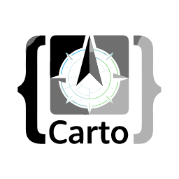

  

# Carto — AI Codebase Bundler

**Bundle your entire project into AI-ready context in one click.**

> Watch the full demo: [ik.imagekit.io/...](https://ik.imagekit.io/9pfz6g8ri/videos/export-1778250170892.mp4)

---

Carto bundles your entire codebase into a single, beautifully structured Markdown file — ready to paste into any AI assistant. It works with multi-provider AI (Gemini, OpenAI, Groq, Ollama), detects your tech stack automatically, and runs entirely locally on your machine.

## Table of Contents
- [Features](#features)
- [Installation](#installation)
- [Usage](#usage)
- [Configuration](#configuration)
- [Privacy & Security](#privacy-and-security)
- [Requirements](#requirements)

---

## Features

- **Multi-Provider AI Integration**  
  Supports Google Gemini, OpenAI (GPT-4o), Groq (Llama 3), and local models via Ollama.

- **Intelligent Context Bundling**  
  Bundles your codebase into a clean, navigable Markdown file with a table of contents, tech stack detection, directory tree, and full file contents grouped by folder.

- **Use AI Toggle**  
  Enable the AI toggle to automatically append a senior-engineer-level codebase analysis to your output — uses a smart compact context to minimize API token usage.

- **Full Output Preview**  
  Preview the entire bundled output with beautiful rendered markdown before saving — right inside the VS Code sidebar.

- **Auto Tech Stack Detection**  
  Detects ecosystem, dependencies, and scripts from `package.json`, `requirements.txt`, `go.mod`, `Cargo.toml`, `pom.xml`, `Gemfile`, `composer.json`, and more.

- **Security Scanning**  
  Automatically detects and excludes `.env`, private keys, credentials, and other sensitive files.

- **Local AI Support**  
  Use Ollama to run models entirely locally — no data leaves your machine.

---

## Installation

1. Open **Visual Studio Code**
2. Go to **Extensions** (`Ctrl+Shift+X`)
3. Search for **Carto**
4. Click **Install**

---

## Usage

**1. Open Carto**  
Click the Carto icon in the Activity Bar, or press `Ctrl+Shift+C` (Windows/Linux) / `Cmd+Shift+C` (macOS).

**2. Configure AI (optional)**  
Click the gear icon to open Settings. Select a provider and enter your API key. Keys are stored locally and never sent to Carto servers.

**3. Bundle**  
Click **Bundle Project**. Carto scans your workspace, skipping `node_modules`, build artifacts, lock files, and sensitive files automatically.

**4. Preview & Export**  
View stats, the directory tree, and click **Preview Output** to see the full rendered bundle. Use **Copy to Clipboard** or **Save as Markdown** to export.

**5. AI Analysis (optional)**  
Toggle **Use AI** to append an expert technical analysis of your codebase to the output. The analysis covers architecture, tech stack, data flow, key components, and improvement suggestions.

---

## Configuration

| Setting | Description | Default |
|---------|-------------|---------|
| `carto.aiProvider` | Active AI provider | `gemini` |
| `carto.geminiApiKey` | Google Gemini API key | `""` |
| `carto.openaiApiKey` | OpenAI API key | `""` |
| `carto.groqApiKey` | Groq API key | `""` |
| `carto.ollamaEndpoint` | Local Ollama endpoint | `http://localhost:11434` |

---

## Privacy and Security

- **Local Processing** — All bundling and scanning happens on your machine.
- **Secure Key Storage** — API keys are stored in VS Code's global settings, never transmitted to Carto.
- **Sensitive File Detection** — `.env`, `*.pem`, SSH keys, credential files, and API key files are flagged and excluded by default.
- **Offline Mode** — Use Ollama for 100% local AI analysis with no external requests.

---

## Requirements

- VS Code **1.118.0** or higher
- Ollama (optional, for local models)

---

   
  
Built with ❤️ by <a href="https://github.com/IamNishant51">Nishant Unavane</a> · <a href="LICENSE">MIT License</a>

